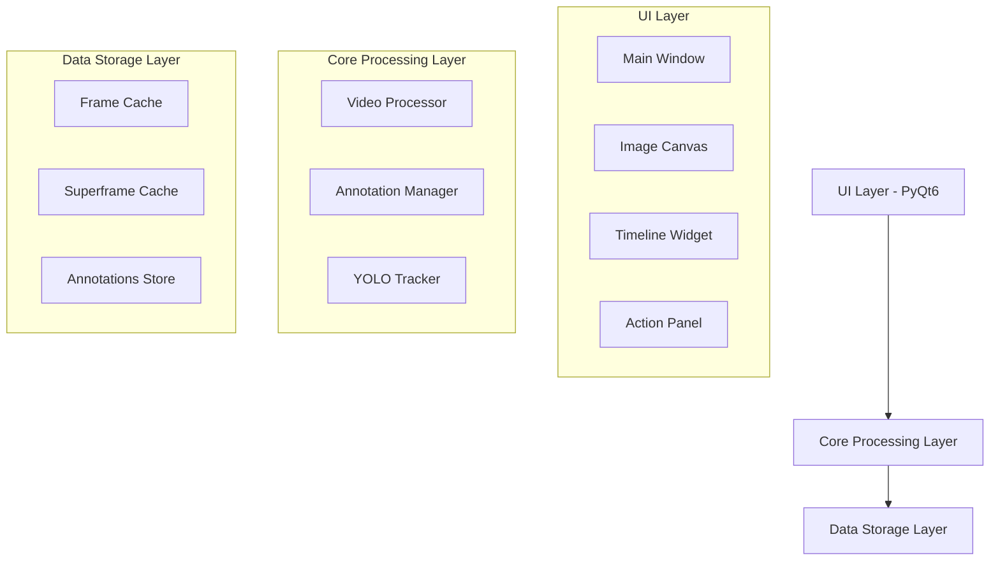
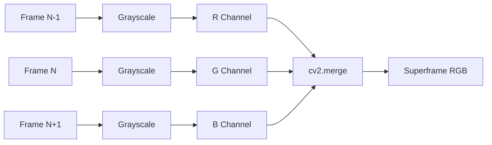
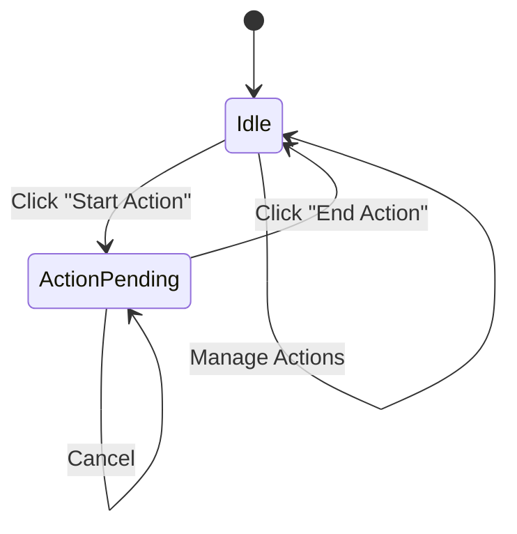
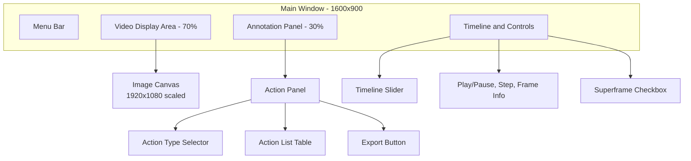
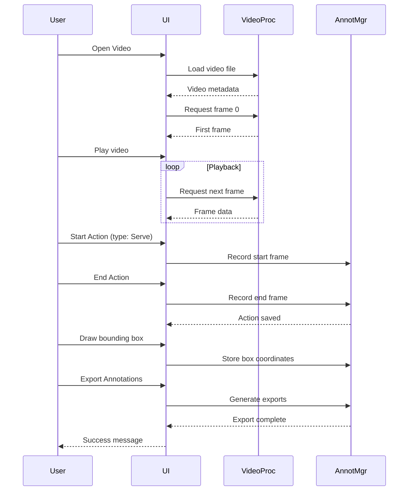

# Volleyball Action Annotator (VAA) - Design Document

## 1. Project Overview

### 1.1 Purpose
Create a professional desktop application for annotating volleyball match videos with support for 3-frame RGB superframes and YOLO format export. The system enables sports analysts to mark action boundaries, visualize temporal patterns through superframes, and export standardized training data for computer vision models.

### 1.2 Target Users
- Sports analysts annotating volleyball matches
- Computer vision researchers preparing training datasets
- Coaches analyzing player and ball movements

### 1.3 Core Value Proposition
Combines temporal motion visualization (via 3-frame superframes) with precise frame-level annotation and standardized export formats, streamlining the workflow from raw video to ML-ready datasets.

## 2. System Architecture

### 2.1 High-Level Components



### 2.2 Component Responsibilities

| Component | Responsibility | Key Operations |
|-----------|---------------|----------------|
| Main Window | Application orchestration, user interaction coordination | Video loading, playback control, UI synchronization |
| Image Canvas | Frame visualization, bounding box editing | Display frames/superframes, handle mouse events for boxes |
| Video Processor | Frame extraction, superframe generation, caching | Read frames, create 3-frame RGB composites, manage cache |
| Annotation Manager | Action tracking, bounding box storage, export | Record action intervals, store YOLO boxes, generate exports |
| YOLO Tracker | Automated object detection | Detect ball and players, provide initial bounding boxes |
| Timeline Widget | Temporal navigation, visual action markers | Seek to frame, display action ranges |
| Action Panel | Action type selection, action list management | Create/edit/delete actions, display action table |

## 3. Core Features Design

### 3.1 Video Processing

#### 3.1.1 Frame Management
- **Loading Strategy**: On-demand frame extraction with intelligent caching
- **Supported Formats**: MP4, AVI (via OpenCV VideoCapture)
- **Target Resolution**: 1920×1080 (all frames resized uniformly)
- **Cache Policy**: LRU-based eviction when memory threshold exceeded (configurable limit, default 100 frames)

#### 3.1.2 Superframe Generation
- **Purpose**: Visualize motion across three consecutive frames by encoding temporal information spatially
- **Algorithm**:
  1. Extract frames at indices: N-1, N, N+1 (where N is center frame)
  2. Convert each frame to grayscale
  3. Assign grayscales to RGB channels: R=frame(N-1), G=frame(N), B=frame(N+1)
  4. Merge into single 3-channel image
- **Boundary Handling**: 
  - First frame (N=0): Use frame 0 for both R and G channels
  - Last frame (N=max): Use last frame for both G and B channels
- **Cache Strategy**: Store generated superframes separately from normal frames, same LRU policy



### 3.2 Playback Control

#### 3.2.1 Playback Modes
- **Play/Pause**: Toggle automatic frame advancement
- **Frame Stepping**: Navigate one frame forward/backward via keyboard or buttons
- **Seeking**: Direct navigation to specific frame via timeline slider

#### 3.2.2 Timeline Interaction
- **Visual Elements**:
  - Horizontal slider representing video duration
  - Action range indicators (colored bars over slider)
  - Current position marker
- **Interaction**:
  - Click/drag to seek to any frame
  - Scroll wheel for fine-grained navigation
  - Display current time and total duration

### 3.3 Action Annotation

#### 3.3.1 Action Types
Supported volleyball action categories:

| Type | Description | Typical Duration |
|------|-------------|------------------|
| Serve | Player initiates rally | 1-3 seconds |
| Reception | Receiving serve | 0.5-1 second |
| Set | Setting ball for attack | 0.5-1 second |
| Attack | Offensive hit | 0.5-1 second |
| Block | Defensive block at net | 0.5-1 second |
| Dig | Defensive save | 0.5-1 second |
| Point | Full rally from serve to point scored | 5-30 seconds |

#### 3.3.2 Annotation Workflow
1. **Start Action**: User clicks "Start Action" button at action beginning
   - Records current frame index
   - Prompts for action type selection (dropdown or button grid)
   - Visual indicator shows pending action
2. **End Action**: User clicks "End Action" button at action conclusion
   - Records end frame index
   - Calculates time interval (using video FPS)
   - Adds action to list with validation (end > start)
3. **Action Management**:
   - Display all actions in table (start time, end time, type)
   - Allow editing existing actions (double-click to modify)
   - Allow deletion (select and delete)
   - Highlight current action on timeline



### 3.4 YOLO Bounding Box Annotation

#### 3.4.1 Object Classes
- **Class 0**: Ball
- **Class 1**: Player
- Additional classes can be configured in settings

#### 3.4.2 Bounding Box Operations
- **Automated Detection**: YOLO model provides initial box suggestions (optional, can be disabled)
- **Manual Creation**: Click-and-drag on canvas to draw new box
- **Box Selection**: Click existing box to select
- **Box Editing**: Drag corners/edges to resize, drag center to move
- **Box Deletion**: Select and press Delete key or right-click menu
- **Class Assignment**: Right-click box to change class

#### 3.4.3 Box Data Format (Internal)
Each box stored as tuple: `(class_id, x_center, y_center, width, height)`
- Coordinates normalized to [0, 1] relative to frame dimensions
- Stored per-frame in annotation manager

#### 3.4.4 Visual Feedback
- Boxes rendered with class-specific colors
- Selected box highlighted with thicker border
- Class label displayed near box
- Semi-transparent fill for better frame visibility

### 3.5 Display Modes

#### 3.5.1 Normal Frame Mode
- Display standard RGB frame extracted from video
- Default mode on application start
- Provides natural visual representation

#### 3.5.2 Superframe Mode
- Toggle via checkbox "Show Superframe"
- Display 3-frame RGB composite
- Reveals motion patterns through color coding:
  - Cyan tints indicate movement from previous frame
  - Yellow tints indicate movement toward next frame
  - Grayscale regions indicate static elements
- Useful for identifying ball trajectory and player movements

### 3.6 Export Functionality

#### 3.6.1 YOLO Format Export
- **Output Structure**:
  ```
  labels/
    ├── 000000.txt
    ├── 000001.txt
    ├── 000142.txt
    └── ...
  ```
- **File Naming**: 6-digit zero-padded frame index (e.g., `000142.txt` for frame 142)
- **File Content**: One line per bounding box
  - Format: `class_id x_center y_center width height`
  - Example: `0 0.512 0.384 0.045 0.062`
- **Empty Frames**: No file generated if frame has no annotations

#### 3.6.2 Action Metadata Export
- **Output File**: `actions.json`
- **Format**: JSON array of action objects
- **Schema**:
  ```
  [
    {
      "start_time": 12.3,
      "end_time": 15.7,
      "type": "Serve",
      "start_frame": 369,
      "end_frame": 471
    },
    ...
  ]
  ```
- **Fields**:
  - `start_time`: Action start in seconds (float)
  - `end_time`: Action end in seconds (float)
  - `type`: Action category (string)
  - `start_frame`: Starting frame index (integer)
  - `end_frame`: Ending frame index (integer)

#### 3.6.3 Export Workflow
1. User clicks "Save Annotation" button
2. System prompts for output directory selection
3. System creates `labels/` subdirectory for YOLO files
4. System writes all annotated frames as individual .txt files
5. System writes `actions.json` in root of selected directory
6. Display confirmation message with file count

## 4. User Interface Design

### 4.1 Main Window Layout



### 4.2 UI Components Specification

#### 4.2.1 Menu Bar
- **File Menu**:
  - Open Video (Ctrl+O)
  - Save Annotations (Ctrl+S)
  - Export (Ctrl+E)
  - Recent Files (submenu)
  - Exit
- **View Menu**:
  - Toggle Superframe Mode (F1)
  - Toggle Bounding Boxes (F2)
  - Fit to Window / Actual Size
- **Annotation Menu**:
  - Start Action (Space)
  - End Action (Enter)
  - Delete Selected Action (Delete)
- **Help Menu**:
  - User Guide
  - Keyboard Shortcuts
  - About

#### 4.2.2 Image Canvas
- **Display Area**: Scalable widget showing current frame or superframe
- **Interaction Modes**:
  - View mode: Pan and zoom
  - Annotation mode: Draw/edit bounding boxes
- **Overlay Elements**:
  - Bounding boxes with labels
  - Frame number indicator (top-left)
  - Current time indicator (top-right)
  - Pending action indicator (if action started)

#### 4.2.3 Timeline Widget
- **Slider**: Horizontal slider spanning video length
- **Action Markers**: Colored bars indicating action ranges
- **Frame Ticks**: Major/minor tick marks for time reference
- **Current Position**: Diamond-shaped marker
- **Interaction**: Click to seek, drag to scrub

#### 4.2.4 Action Panel
- **Action Type Selector**: Button grid or dropdown for quick type selection
  - Grid layout: 3x3 buttons for 7 action types + custom
  - Visual icons for each type
- **Action Controls**:
  - "Start Action" button (green, prominent)
  - "End Action" button (red, enabled only when action pending)
- **Action List Table**:
  - Columns: Start Time, End Time, Type, Duration
  - Sortable by any column
  - Row selection highlights corresponding timeline marker
  - Double-click to edit
  - Right-click context menu (Edit, Delete, Go to Start, Go to End)
- **Export Section**:
  - "Export Annotations" button
  - Export format selector (currently YOLO only, extensible)
  - Export status indicator

#### 4.2.5 Control Bar
- **Playback Controls**:
  - Play/Pause button (toggle icon)
  - Previous Frame button (|<)
  - Next Frame button (>|)
- **Display Options**:
  - "Show Superframe" checkbox
  - "Show Bounding Boxes" checkbox
- **Frame Information**:
  - Current frame number
  - Current timestamp (MM:SS.fff)
  - Total frames and duration
  - Playback speed selector (0.25x, 0.5x, 1x, 2x)

### 4.3 Keyboard Shortcuts

| Shortcut | Action |
|----------|--------|
| Space | Play/Pause |
| Left Arrow | Previous Frame |
| Right Arrow | Next Frame |
| Home | Go to First Frame |
| End | Go to Last Frame |
| Enter | Start/End Action (toggle) |
| 1-7 | Quick select action type |
| F1 | Toggle Superframe Mode |
| F2 | Toggle Bounding Box Display |
| Delete | Delete Selected Action/Box |
| Ctrl+Z | Undo Last Annotation |
| Ctrl+S | Save Annotations |

## 5. Data Model

### 5.1 Video Metadata
| Field | Type | Description |
|-------|------|-------------|
| file_path | string | Absolute path to video file |
| fps | float | Frames per second |
| total_frames | integer | Total frame count |
| duration | float | Video duration in seconds |
| resolution | tuple(int, int) | Original video resolution |
| target_size | tuple(int, int) | Processing resolution (1920, 1080) |

### 5.2 Action Record
| Field | Type | Description |
|-------|------|-------------|
| id | integer | Unique action identifier |
| start_frame | integer | Starting frame index |
| end_frame | integer | Ending frame index |
| start_time | float | Start time in seconds |
| end_time | float | End time in seconds |
| type | string | Action category (Serve, Reception, etc.) |
| created_at | timestamp | Annotation creation time |

### 5.3 Bounding Box Record
| Field | Type | Description |
|-------|------|-------------|
| frame_idx | integer | Frame index where box exists |
| class_id | integer | Object class (0=Ball, 1=Player) |
| x_center | float | Normalized x-coordinate of box center [0-1] |
| y_center | float | Normalized y-coordinate of box center [0-1] |
| width | float | Normalized box width [0-1] |
| height | float | Normalized box height [0-1] |
| confidence | float | Detection confidence (if auto-generated) |
| manual | boolean | Whether manually created or auto-detected |

### 5.4 Application State
| Field | Type | Description |
|-------|------|-------------|
| current_frame_idx | integer | Currently displayed frame |
| is_playing | boolean | Playback state |
| show_superframe | boolean | Display mode flag |
| show_boxes | boolean | Bounding box visibility |
| pending_action | object \| null | Action in progress (if any) |
| selected_box_id | integer \| null | Currently selected box |
| zoom_level | float | Canvas zoom factor |
| playback_speed | float | Playback multiplier |

## 6. Technical Specifications

### 6.1 Technology Stack
| Component | Technology | Version |
|-----------|-----------|---------|
| Language | Python | ≥3.13 |
| UI Framework | PyQt6 | 6.9.0 |
| Computer Vision | OpenCV (cv2) | Latest compatible |
| Object Detection | Ultralytics YOLO | ≥8.3.103 |
| Numerical Processing | NumPy | ≥2.1.1 |
| Logging | Loguru | ≥0.7.3 |

### 6.2 Performance Requirements
| Metric | Target | Rationale |
|--------|--------|-----------|
| Frame Load Time | <100ms | Smooth scrubbing experience |
| Superframe Generation | <200ms | Acceptable mode switching delay |
| Cache Memory Limit | 2GB | Balance between performance and memory usage |
| UI Responsiveness | <16ms | 60 FPS UI updates |
| Export Speed | >100 frames/sec | Reasonable wait for large videos |

### 6.3 Cache Management Strategy
- **Cache Structure**: Two separate dictionaries (frame_cache, superframe_cache)
- **Eviction Policy**: Least Recently Used (LRU)
- **Size Tracking**: Monitor total memory consumption via frame count × frame size
- **Threshold**: Evict oldest entries when total size exceeds configured limit
- **Prefetching**: Optionally preload adjacent frames during idle time
- **Persistence**: No disk caching in initial version (future enhancement)

### 6.4 YOLO Integration
- **Model Loading**: Load model once at application startup or on first detection
- **Inference Trigger**: Optional auto-detection on frame change (toggle in settings)
- **Confidence Threshold**: Configurable minimum confidence (default 0.5)
- **Batch Processing**: Support running detection on frame ranges
- **Model Selection**: Allow user to specify custom YOLO model path

## 7. Workflow and User Stories

### 7.1 Typical Annotation Session



### 7.2 User Story: Annotate Serve Action
1. **Context**: Analyst wants to mark a serve action and track the ball
2. **Steps**:
   - Load volleyball match video
   - Navigate to point where server prepares to serve
   - Click "Start Action" and select "Serve" type
   - System records current frame (e.g., frame 150)
   - Play video or step through frames
   - When ball is in play, click "End Action"
   - System records end frame (e.g., frame 175) and calculates duration (0.83s at 30fps)
   - Toggle "Show Superframe" to verify ball trajectory visibility
   - Draw bounding box around ball on key frames
   - System stores boxes for frames 150-175
3. **Outcome**: Serve action annotated with temporal bounds and ball position data

### 7.3 User Story: Export Dataset for Training
1. **Context**: Researcher needs YOLO training data from annotated video
2. **Steps**:
   - Complete annotation of video (actions and bounding boxes)
   - Click "Export Annotations"
   - Select output directory (e.g., `/datasets/volleyball_match_001/`)
   - System creates `labels/` directory with .txt files for each annotated frame
   - System creates `actions.json` with action metadata
3. **Outcome**: Standardized dataset ready for YOLO model training

## 8. Configuration and Settings

### 8.1 Application Configuration
| Setting | Type | Default | Description |
|---------|------|---------|-------------|
| target_resolution | tuple | (1920, 1080) | Processing frame size |
| cache_limit_frames | integer | 100 | Maximum cached frames |
| default_fps | float | 30.0 | Assumed FPS if detection fails |
| yolo_model_path | string | "yolov8n.pt" | Path to YOLO model |
| yolo_confidence | float | 0.5 | Minimum detection confidence |
| auto_detect | boolean | false | Auto-run YOLO on frame change |
| export_format | string | "yolo" | Default export format |
| ui_language | string | "en" | Interface language |

### 8.2 User Preferences
| Preference | Type | Default | Description |
|------------|------|---------|-------------|
| recent_files | list | [] | Recently opened videos |
| default_action_type | string | "Point" | Default action type selection |
| show_superframe_on_start | boolean | false | Initial display mode |
| playback_speed | float | 1.0 | Default playback multiplier |
| box_colors | dict | {0: "red", 1: "blue"} | Class-specific box colors |
| keyboard_shortcuts | dict | {...} | Customizable shortcuts |

## 9. Error Handling and Validation

### 9.1 Video Loading Errors
| Error Condition | User Feedback | System Behavior |
|-----------------|---------------|-----------------|
| File not found | "Video file does not exist" dialog | Abort loading, maintain previous state |
| Unsupported format | "Format not supported. Use MP4 or AVI" | Abort loading |
| Corrupted file | "Cannot read video file" | Abort loading |
| Insufficient memory | "Video too large for available memory" | Suggest reducing cache limit |

### 9.2 Annotation Validation
| Validation Rule | Error Message | Correction |
|-----------------|---------------|-----------|
| End before start | "Action end must be after start" | Reject action, keep start pending |
| Overlapping actions | "Warning: Actions overlap" | Allow but highlight in UI |
| Box out of bounds | Auto-clamp coordinates | Silently adjust to [0, 1] range |
| Duplicate box on frame | "Box already exists at this location" | Allow but warn user |

### 9.3 Export Errors
| Error Condition | User Feedback | Recovery Action |
|-----------------|---------------|-----------------|
| Write permission denied | "Cannot write to directory" | Prompt for different directory |
| Disk full | "Insufficient disk space" | Abort export, preserve annotations |
| No annotations | "No annotations to export" | Inform user, suggest annotation first |

## 10. Future Enhancements

### 10.1 Planned Features (Out of Scope for Initial Version)
- **Multi-video Project**: Manage multiple videos in single project
- **Annotation Templates**: Save/load action type configurations
- **Collaborative Annotation**: Multi-user annotation with conflict resolution
- **Advanced Analytics**: Action duration statistics, heatmaps
- **Video Preprocessing**: Brightness/contrast adjustment, stabilization
- **Custom Export Formats**: COCO JSON, Pascal VOC, TFRecord
- **Automated Action Detection**: ML model for suggesting action boundaries
- **Timeline Minimap**: Visual preview of entire video on timeline
- **Undo/Redo Stack**: Full annotation history with multi-level undo
- **Annotation Review Mode**: Dedicated mode for quality checking
- **Bulk Operations**: Apply action type to multiple frames simultaneously
- **Performance Profiling**: Built-in diagnostics for cache and rendering

### 10.2 Extensibility Points
- **Plugin Architecture**: Allow custom action types and export formats
- **Custom YOLO Models**: Easy integration of domain-specific models
- **Scripting API**: Python API for batch annotation tasks
- **External Tool Integration**: Export to video editing software

## 11. Testing Strategy

### 11.1 Unit Testing Focus Areas
- Superframe generation algorithm accuracy
- Bounding box coordinate normalization and denormalization
- Action time calculation with various FPS values
- Cache eviction logic under memory pressure
- Export file format correctness

### 11.2 Integration Testing Scenarios
- Load various video formats and resolutions
- Toggle between normal and superframe modes during playback
- Create overlapping actions and verify table display
- Export and re-import annotations
- Handle video seeking while action is pending

### 11.3 User Acceptance Testing
- Annotate 10-minute volleyball match with all action types
- Verify exported YOLO files load correctly in training pipeline
- Confirm superframe mode reveals ball trajectory effectively
- Validate UI responsiveness with 4K video source

## 12. Deployment and Distribution

### 12.1 Installation Method
- **Package Format**: Python wheel distributed via PyPI or direct download
- **Dependency Management**: Poetry or pip for dependency installation
- **Platform Support**: Windows, macOS, Linux (PyQt6 cross-platform)

### 12.2 System Requirements
- **Operating System**: Windows 10+, macOS 11+, Ubuntu 20.04+
- **Python Version**: 3.13 or higher
- **RAM**: Minimum 4GB, recommended 8GB
- **Disk Space**: 500MB for application + space for video files
- **Display**: Minimum 1280x720, recommended 1920x1080

### 12.3 Initial Setup
1. Install Python 3.13+
2. Install VAA package: `pip install VAA`
3. Download YOLO model (optional, auto-downloaded on first detection)
4. Launch application: `vaa` command or desktop shortcut
5. Configure settings via Settings dialog

## 13. Success Metrics

| Metric | Target | Measurement Method |
|--------|--------|-------------------|
| Annotation Speed | >60 actions/hour | Timed user testing |
| Export Success Rate | >99% | Error logs analysis |
| UI Responsiveness | 60 FPS sustained | Frame timing profiler |
| User Satisfaction | >4.5/5 | Post-use survey |
| Learning Curve | <30 min to productivity | New user observation |
| Crash Rate | <1 per 100 hours | Telemetry data |
