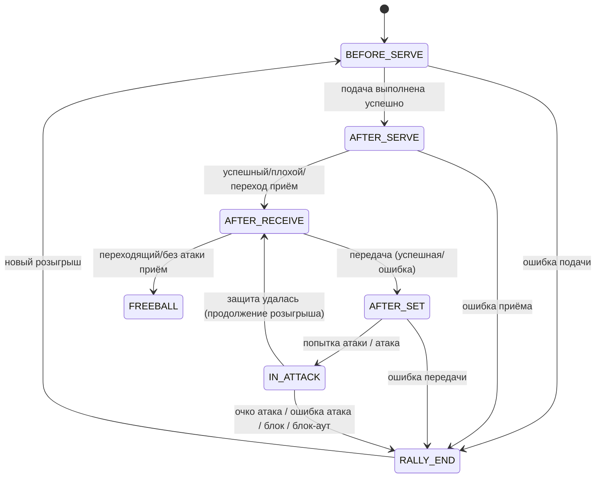

# Quick User Guide - Box Class Annotation

## Rally State Machine



## 🎯 Drawing Boxes with Classes

### Step 1: Select Class
Look for **"Draw Class"** dropdown in control bar:
```
[Draw Class: Serve ▼]
```

Choose from:
- 🔴 Serve
- 🔵 Reception  
- 🔷 Set
- 🟠 Attack
- 🟢 Block
- 🟡 Dig

### Step 2: Draw Box
- Click and drag on canvas to create box
- Box appears with selected class name and color
- Class name displays above box

---

## ✏️ Changing Box Class

### Method 1: Right-Click Menu (Recommended)
1. **Right-click** on any box
2. Select **"Change Class"**
3. Click desired class from submenu
4. Box instantly updates with new color and label

### Method 2: Delete and Redraw
1. Delete box (Delete key or right-click → Delete)
2. Select new class from dropdown
3. Draw new box

---

## 🗑️ Deleting Boxes

### Method 1: Delete Key
1. Click box to select (turns green)
2. Press **Delete** key

### Method 2: Context Menu
1. **Right-click** on box
2. Select **"Delete Box"**

---

## 🎨 Color Reference

Each action class has a unique color:

| Action | Color | Hex Code |
|--------|-------|----------|
| Serve | 🔴 Red | #FF6B6B |
| Reception | 🔵 Cyan | #4ECDC4 |
| Set | 🔷 Blue | #45B7D1 |
| Attack | 🟠 Orange | #FFA07A |
| Block | 🟢 Green | #98D8C8 |
| Dig | 🟡 Yellow | #F7DC6F |

---

## 💡 Tips

### Efficient Workflow
1. **Before annotating**: Set default class in dropdown
2. **While annotating**: Draw all boxes of same type
3. **For corrections**: Use right-click to change class
4. **For multiple classes**: Switch dropdown between draws

### Common Scenarios

**Scenario 1: Annotating Serve Sequence**
```
1. Set "Draw Class" to "Serve"
2. Draw box around server
3. Advance frames, box follows action
4. When serve ends, box auto-disappears
```

**Scenario 2: Mixed Actions (Attack + Block)**
```
1. Draw "Attack" box on attacker
2. Switch to "Block" in dropdown  
3. Draw "Block" box on blocker
4. Both actions tracked simultaneously
```

**Scenario 3: Correcting Mistakes**
```
Oops, drew "Serve" instead of "Reception":
→ Right-click box
→ Change Class → Reception
→ Done! No need to redraw
```

---

## ⌨️ Keyboard Shortcuts

| Key | Action |
|-----|--------|
| Left-Click + Drag | Draw new box |
| Right-Click | Open context menu |
| Delete | Remove selected box |
| Left/Right Arrow | Navigate frames |
| Space | Play/Pause |

---

## 📊 Verification

### Check Your Annotations
1. Look at **box colors** - each class has distinct color
2. Read **class labels** - displayed above each box
3. Review **Action Panel** - lists all auto-tracked actions
4. Check **Timeline** - shows action ranges with colors

### Before Export
- ✅ All boxes have correct class labels
- ✅ Colors match expected actions
- ✅ No duplicate or overlapping boxes
- ✅ Actions tracked properly

---

## 🚨 Troubleshooting

**Box shows wrong color**
→ Right-click → Change Class to correct type

**Can't select box**
→ Make sure "Show Boxes" checkbox is enabled

**Delete doesn't work**
→ Click box first to select (turns green), then Delete

**Wrong class when drawing**
→ Check "Draw Class" dropdown selection

---

## 📝 Example Workflow

### Annotating a Rally

```
Frame 100: Server prepares
  → Set "Draw Class: Serve"
  → Draw box around server
  → Label shows "Serve" in red

Frame 105: Ball in air
  → Box follows ball automatically

Frame 110: Receiver contacts ball
  → Set "Draw Class: Reception"
  → Draw new box around receiver
  → Label shows "Reception" in cyan

Frame 115: Setter touches ball
  → Set "Draw Class: Set"
  → Draw box on setter
  → Label shows "Set" in blue

Frame 120: Attacker spikes
  → Set "Draw Class: Attack"
  → Draw box on attacker
  → Label shows "Attack" in orange

Frame 122: Blocker jumps
  → Set "Draw Class: Block"  
  → Draw box on blocker
  → Label shows "Block" in green

Frame 125: Rally ends
  → Boxes disappear
  → Actions auto-saved with durations
```

**Result**: 5 separate actions tracked automatically!

---

## 🎓 Best Practices

### DO ✅
- Select class **before** drawing
- Use **right-click** to fix mistakes
- **Verify** class labels match actions
- Check **colors** for visual confirmation
- Use **context menu** for quick changes

### DON'T ❌
- Don't delete and redraw for class changes
- Don't forget to check dropdown before drawing
- Don't overlap boxes of different classes
- Don't annotate on wrong frame

---

## Need Help?

1. Check class label above box
2. Verify color matches action type
3. Use right-click menu for corrections
4. Review this guide for workflow tips

**Happy Annotating! 🏐**
