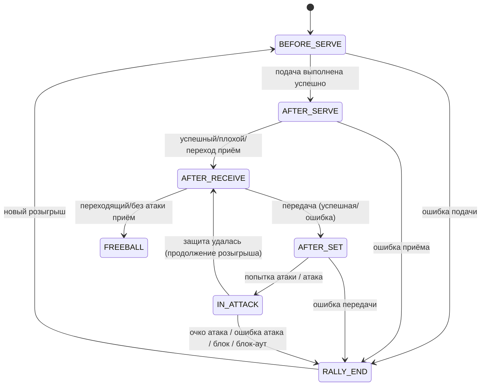

Проект: Volleyball Action Annotator (VAA)
Цель: Инструмент разметки волейбольного матча

Размечаем начало и конец игрового действия
Поддерживаем 3-frame grayscale → RGB (суперкадр)
Пользователь видит обычный кадр, но может переключиться на суперкадр
Сохраняем разметку в YOLO-формате (по кадрам) + временные метки действий


Serve, Reception, Set, Attack, Block, Dig

## State Machine



```
src/
├── core/
│   ├── video_processor.py        ← Логика 3-frame RGB
│   ├── annotation_manager.py     ← Управление действиями и YOLO-боксами
│   └── yolo_tracker.py           ← Обёртка над YOLO
│
├── ui/
│   ├── image_canvas.py           ← (существующий) + улучшения
│   ├── main_window.py            ← Основное окно
│   └── widgets/
│       ├── timeline.py
│       └── action_panel.py
│
├── config/
│   └── config.py                 ← AnnotationConfig + UI настройки
│
└── utils/
    └── exporters.py              ← JSON, YOLO txt, CSV
```

